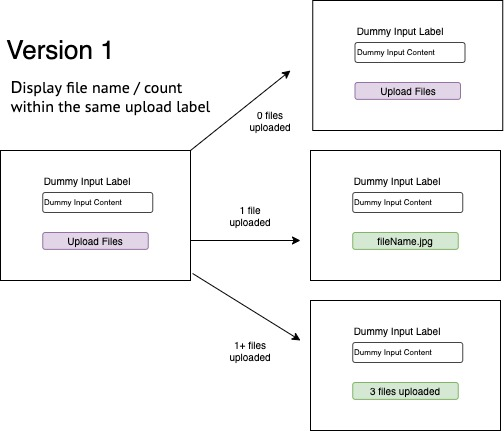

import { Link } from "gatsby"
import Accordion from "../../components/blog/accordion/Accordion"
import AccordionSection from "../../components/blog/accordion/AccordionSection"
import A11yChecklist from "../../components/ui/A11yChecklist"
import BodyText from "../../components/ui/BodyText"
import References from "../../components/ui/References"

## Overview
<BodyText>
My explorations into building accessible, custom-styled file upload functionality. First in HTML with vanilla JS, then again in React.
</BodyText>  

- [HTML & ES6 CodeSandbox](https://codesandbox.io/s/accessible-custom-styled-file-input-vanilla-js-fw6b8?file=/index.html)
- [React CodeSandbox](https://codesandbox.io/s/accessible-custom-styled-file-input-react-r3h91?file=/src/Form/FileUpload.js)

> Disclaimer: The internet is full of wonderful articles on accessible, custom-styled file upload buttons. This post does not attempt to reinvent the wheel. It is my personal exploration of what is required to make the key components of the web inclusive and accessible.

<BodyText>
This post will focus on simple functionality alongside custom-styling. The image below outlines the functionality. 
</BodyText>  


  
  <BodyText>
</BodyText>
<BodyText>
  {" "}
  A follow-up blog-post will focus on expanding this functionality to create a more complex visual solution. The image below outlines the functionality:
</BodyText>  


  
  <BodyText>
</BodyText>

## My accessibility checklist

This list was created based on the published advice of accessibility experts and standards groups. Initial testing was conducted by myself, using built-in Android and Mac accessibility tooling

**This is not, and is not intended to act as, a replacement for diverse user testing.**

<A11yChecklist />

## Basic Mark-up

```
   <input
      id="fileupload"
      class="visually-hidden"
      type="file"
    />
    <label for="fileupload" class="btn">
      <span>Upload files</span>
    </label>
```

## How & Why?

<Accordion>
  <div title="Signalling functionality for keyboard users #1">
    <h4>Feature:</h4>
    <p>Harness default functionality</p>
    <h4>Rationale:</h4>
    <p>
    Inputs of type "file" will open the file upload screen by touch, click, and keyboard access by default. A correctly associated label will adopt the same functionality. 
    </p>
    <h4>Implementation details:</h4>
    <p>By (a) linking the label and the input via their respective "for"
 and "id" attributes, and (b) hiding the input using a visually hidden class, we can visually hide the default file input whilst ensuring that the file upload screen is accessible via click, touch, and the "space" or enter" key. No JavaScript required!
 
</p>
  </div>
  <div title="Signalling functionality for keyboard users #2">
    <h4>Feature:</h4>
    <p>
      Update the label to reflect successful file upload
    </p>
    <h4>Rationale:</h4>
    <p>
      Screen readers will read out the updated label after the file dialog has closed, providing feedback that the task was completed without needing to navigate elsewhere on the page. 
   </p>
  </div>
  <div title="Signalling functionality to sighted users #1">
    <h4>Feature:</h4>
    <p>
      Adding a focus state to the label</p>  
    <h4>Rationale:</h4>
    <p>
     Visually hiding the input also hides the visual feedback provided to sighted users on focus. </p>  <p>To reinstate focus, it needs to be added to the associated label.</p><p> However, labels are not focusable by default, and aria-roles (such as "button" ) applied to labels do not take effect. Adding a tab-index to the label will allow it to be focused, but only *after* the visually-hidden element has also been focused. This creates a visually misleading scenario, and duplicated tab points for screen readers.
</p>
<p>
CSS can be used to circumvent this. 
    </p>
    <h4>Implementation details:</h4>
   <p>Using CSS to recreate the focus state on the label requires the HTML to be in a specific order - the label must come after the input. This is because there is no parent selector in CSS, so you would not be able to target a label containing an input, and the adjacent sibling selector does not track backwards, so you would not be able to target a label ordered before the input. 
</p>
  </div>
</Accordion>

<References>
<h3>Implementation References</h3>
<a href="http://tympanus.net/codrops/2015/09/15/styling-customizing-file-inputs-smart-way/" target="_blank">Styling & Customizing File Inputs the Smart Way</a>;  <a href="https://accessabilly.com/a-styled-accessible-file-upload/" target="_blank">A styled accessible file upload</a>; <a href="http://wtfforms.com/" target="_blank">WTF Forms</a> 
</References>


## Results

- [HTML & ES6 CodeSandbox](https://codesandbox.io/s/accessible-custom-styled-file-input-vanilla-js-fw6b8?file=/index.html)
- [React CodeSandbox](https://codesandbox.io/s/accessible-custom-styled-file-input-react-r3h91?file=/src/Form/FileUpload.js)

